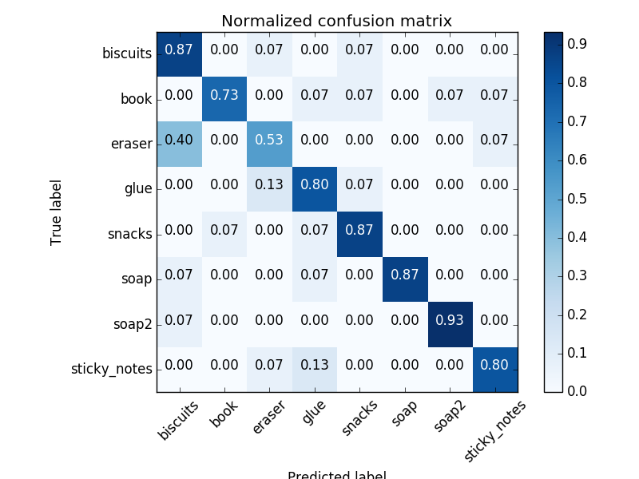
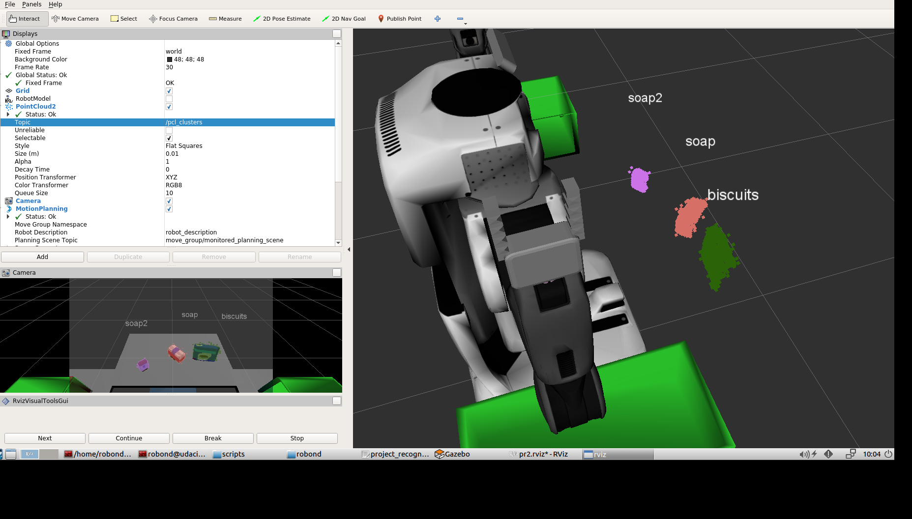
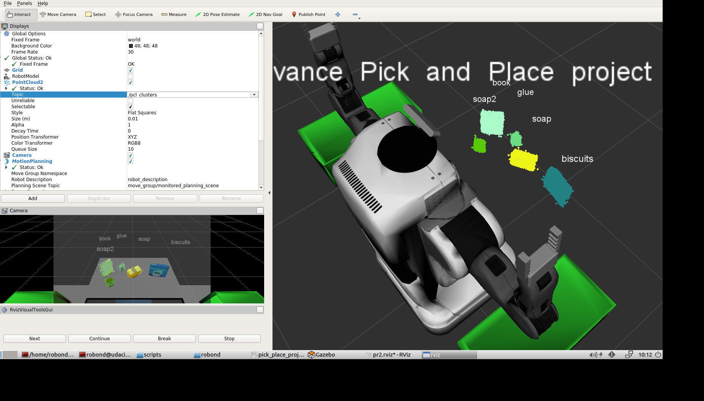
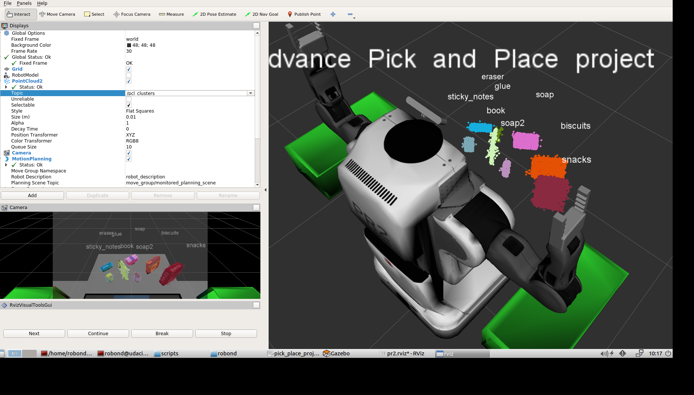

## Project: Perception Pick & Place

### Exercise 1, 2 and 3 pipeline implemented
#### 1. Complete Exercise 1 steps. Pipeline for filtering and RANSAC plane fitting implemented.
Exercise 1 was done in `RACSAC.py`. Most of the code was also used in Exercise 2, and 3 and the project.

In the project, the dropboxes were in the vision of the RGB-D sensor, which cause them to be considered as objects and then classified. To resolve this, the y-axis was restricted using the passthrough filter so only the points of the objects and the main table were used in the RANSAC plane fitting.

#### 2. Complete Exercise 2 steps: Pipeline including clustering for segmentation implemented.
Exercise 2 was done in `segmentation.py` and was used in Exercise 3 and the project.

Pretty straightforward. Values in the project were obtained by trial-and-error.

#### 3. Complete Exercise 3 Steps.  Features extracted and SVM trained.  Object recognition implemented.
Exercise 3 was done in `object_recognition.py` and was used in the project.

In the project, a total of 8 different items were used: `soap`, `soap2`, `book`, `biscuits`, `eraser`, `glue`, `sticky_notes` and `snacks`.
Only 15 random poses of each item was used in generating the training set.
Training the SVM on this training set, and then testing it resulted in exactly 80% accuracy.

Initially, I trained a model for each of the given worlds (i.e. world1's model only contained 3 categories, world2's model contained 6 categories and world3's model contained all 8 categories). While this had better results for the individual worlds (since there are less false positives), I found that the use of a model with all categories worked decently well and used this simpler version for the submission. :p

### Pick and Place Setup

#### 1. For all three tabletop setups (`test*.world`), perform object recognition, then read in respective pick list (`pick_list_*.yaml`). Next construct the messages that would comprise a valid `PickPlace` request output them to `.yaml` format.

The initial part of the project was mostly just using the code in the exercises, and tweaking the values in the filters accordingly.
After the tweaking, the following RViz screenshots were taken for each of the given worlds.

While the results in these screenshots seem to perform the recognition with **100% accuracy**, world 3 occasionally had the `sticky_notes` being recognised as `book` or `eraser`. One way this could be resolved could simply be increasing the training data generated.

After verifying that the object recognition was performing decently well, I moved on to creating the move commands and outputting them to `.yaml` files. At first I was pretty confused as to when should these commands be output in the entire perception pipeline, since the object recognition was done on every incoming topic message. But I guess overwriting the output file every time would still give me what I needed.  
Then, first reading in the parameters in `dropbox.yaml` enabled me to determine which arm/side is meant for `green` objects and which is meant for `red` objects. While this was not a requirement, I just thought it would be better if the code still worked even if the dropboxes were swapped. Then, I read in the parameters of `pick_list_*.yaml`, and checked whether each of the items have been identified in the scene. If they have been, their commands would be appended to the command list.

##### Challenge attempt
Of course, it never ends here!!
I attempted to implement the full pipeline of picking and placing the objects, although I am pretty unsure how to complete this without making significant changes to the code.

Two different pipelines were explored:
- First was the straightforward way of calling the mover service for *each* of the pick list objects after finishing object recognition. This meant that the perception would only be re-processed after the moving commands have all been completed. While this seemed to position the arm correctly in some of my trials, it seems to only occasionally grab hold the target object. Not sure if this was due to the motion planning detecting a collision and thus releasing the grip, although it does occasionally give errors of `GOAL_TOLERANCE_VIOLATED`.
While this would probably work out for this project, any scene changes in the motion duration would break the pipeline.
- The second way that was explored was to publish the detected object list in the `pcl_callback` function, then creating a separate subscriber to subscribe to this detected object list. While this enabled a more dynamic recognition, when the arm of the robot came into vision, it was detected as a separate object. The main cause of concern with this way is that the table and clusters information are lost since they are not published together with the list. Then, how should the collision be computed?

##### Issues to figure out
1. How should the collision publishing be done? 1 message of concatenated point clouds, or can they be separately published? In the case of separately publishing, how do I remove objects that have already been picked and placed?
    - To concatenate these point clouds, do I have to convert them into lists, concatenate the lists, then convert them back to point clouds?
2. How do I rotate the robot without executing further code, since rotation command is sent using a pub-sub architecture? Do I simply use `rospy.sleep(rospy.Duration(10))`?

Will continue to work on these issues if I have the chance in the near future!
